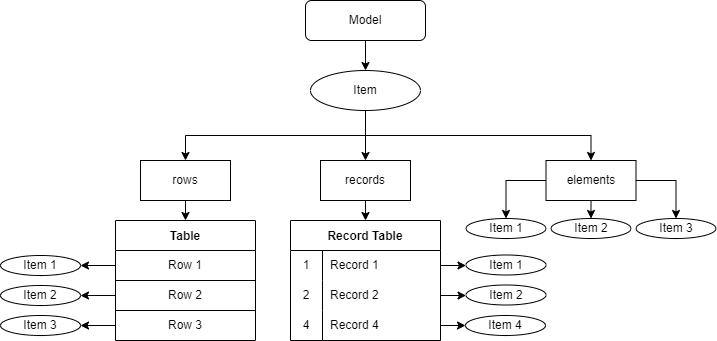

# AceTreeModel

---

## 简介

`AceTreeModel`是为 ChorusKit 设计的文档模型，它相当于一个树型的内存数据库。

之所以没有使用`QAbstractItemModel`，是因为它只能使用行列索引元素，并且查找、删除、插入都是线性复杂度，对于音符、控制点这类顺序关系复杂、数量多的图形元素，处理效率特别低。

## 特性

`AceTreeModel`维护一颗具有事务属性的树，它会记录与它关联的所有结点的更改，支持以日志的形式将状态持久化在文件系统中。因此，如果应用程序发生异常退出（或者系统发生断电），通过日志可以将所有状态恢复。

### 多种节点存储方式

`AceTreeItem`是`AceTreeModel`的节点数据结构，它支持同时维护三组子节点（线性表、自增主键表、集合）。



+ 线性表（Vector - Rows）
    + 适合存储数量不太多、顺序关系明确、不存储自身索引的元素
    + 父节点以连续数组的形式维护线性表中子节点的顺序关系
        + 插入/删除：O(n)
        + 追加：O(1)
        + 查找索引：O(n)
        + 索引访问：O(1)

+ 自增主键表（RecordTable - Records）
    + 适合存储数量多、没有顺序关系、存储自身排序关键字的元素
    + 父节点按照插入顺序为每个子节点分配自增ID，已删除的元素的ID不会再次出现
        + 插入/删除：O(1)
        + 查找 ID：O(1)
        + ID 访问：O(1)
+ 集合（Set - Nodes）
    + 适合存储数量固定、没有顺序关系的元素，使用字符串索引
    + 父节点仅维护子节点的指针集合
        + 插入/删除：O(1)
        + 查找：O(1)

### 节点属性

`AceTreeItem`除了子节点以外，也维护了一些与自身关联的数据结构。

+ 属性表
    + 字符串到任意类型的哈希表，操作均为常数时间

+ 动态数据表
    + 字符串到任意类型的哈希表，操作均为常数时间

+ 字节数组
    + 可存储二进制数据，提供增、删、替换、查找等操作## 历史记录机制

### 特殊操作

不会被记录的操作

+ setDynamicData（可用于设置与文档无关的关联数据）

### 元操作类型

在所有权属于`model`的节点上进行以下操作，会被记录
+ setProperty/setAttribute（设置属性）

+ setBytes（覆写字节）
+ insertBytes（插入字节）
+ removeBytes（删除字节）

+ insertRows（插入线性表元素）
+ removeRows（删除线性表元素）

+ addRecord（添加自增主键表记录）
+ removeRecord（删除自增主键表记录）

+ addNode（添加集合元素）
+ removeNode（删除集合元素）

在`model`上进行以下操作，会被记录

+ setRootItem（替换根节点）


### 节点所有权

一般的历史记录框架，在对插入/删除操作进行撤销/重做时，会将变更的实例进行序列化/反序列化，这样会比较低效。在`AceTreeModel`的实现方式中，为了使事务机制更高效，我们为`AceTreeItem`引入了所有权的概念。

起初，`model`是空的，它甚至没有根节点。用户需要使用`new`操作符创建一个`item`，并对其进行修改或添加子节点。

+ 例子（代码仅用于陈述特性）

    ```c++
    auto model = new AceTreeModel(); // Empty model

    auto rootItem = new AceTreeItem("root");
    auto childItem = new AceTreeItem("child");
    auto tempItem = new AceTreeItem("temp");
    auto grandItem = new AceTreeItem("grandson");

    rootItem->setAttribute("name", "foo");   // Op1
    rootItem->appendRow(childItem);          // Op2
    rootItem->appendRow(tempItem);           // Op3
    rootItem->removeRow(tempItem);           // Op4
    ```
    + 首先我们创建了一些`item`，对`rootItem`进行了设置属性、添加子节点、删除子节点的操作，此时`childItem`是其子节点，而`tempItem`被我们添加了以后又移除了，此时
        + `rootItem`没有父节点，所有权属于用户
        + `childItem`的父节点是`rootItem`，所有权属于`rootItem`
        + `tempItem`在`Op3`后所有权属于`rootItem`，在`Op4`后所有权属于用户
    + 结论：
        + 在不与模型发生任何关联时，一个`item`如果有父节点，那么其所有权属于父节点，否则所有权属于用户
        + 所有权属于用户的`item`，如果不使用需要用户删除，否则会引起内存泄漏
        + 用户删除`item`后，其所有子节点都会递归删除
        + 用户删除一个有父节点的`item`，会自动与其父节点解除关系（不推荐这么做）

    ```c++
    model->setRootItem(rootItem);            // Op5
    rootItem->setAttribute("name", "bar");   // Op6
    childItem->setAttribute("num", 1);       // Op7
    grandItem->setAttribute("name", "baz");  // Op8
    childItem->addRecord(grandItem);         // Op9
    grandItem->setAttribute("name", "hack"); // Op10
    rootItem->removeRow(childItem);          // Op11
    ```
    + `Op5`将`rootItem`设为了`model`的根节点，从此时开始，`rootItem`以及`rootItem`的所有子孙节点的所有权不再属于用户，全部转移给了`model`，上述节点中
        + `tempItem`的所有权属于用户，因为它已经从`childItem`被删除了
        + `grandItem`的所有权属于用户
    + `Op6`、`Op7`两步对`rootItem`与`childItem`进行了改动，这两步会被`model`记录
    + `Op8`改动了`grandItem`，由于`grandItem`此时还不属于`model`，因此其改动不会记录
    + `Op9`将`grandItem`添加给了`childItem`，此时`grandItem`的所有权也属于`model`了，并且这一步也会被记录
    + `Op10`改动了`grandItem`，这一步会被记录
    + `Op11`从`rootItem`中移除了`childItem`，此时`childItem`的所有权还是属于`model`，并且它已经被标记为废弃状态，用户不应对其进行任何写操作
    + 结论：
        + 一个`item`一旦被设置为`model`的根节点，或者被插入到了任何一个属于`model`的节点，它本身以及它的所有子孙节点的所有权都将转移给`model`
        + 一个`item`的所有权一旦转移给了`model`，即使将它从它的父节点移除，其所有权依然属于`model`，并且从移除时起它会被`model`标记为废弃状态，虽然还能进行只读访问，但是用户应该将它视为已被删除的节点
        + 一个`item`如果属于`model`，那么对它的操作都会被记录（包括修改属性、添加子节点等），并且用户不能将它插入到其他的`item`中或设为其他`model`的根节点

## 与 Json 的关系

`AceTreeItem`的设计与`json`格式有着密切联系。

我们知道，`json`格式的`value`分为三种，分别是`array`、`object`与基本类型（`double`、`bool`、`null`、`string`），一个`item`实际上就是用来描述一个`array`或`object`的。

因此，对于一个`item`，它的属性表、线性表、字节数组、自增主键表、集合可以被我们使用，我们通常会使用以下四种形式之一：
+ 仅使用属性表与集合
    + 相当于`object`，属性表用来存放以字符串索引的基本类型，集合用来存放字符串索引的子级`array`或`object`
+ 仅使用线性表
    + 相当于有序`array`，有序`array`中两个元素交换顺序后讲不再是原来的`array`
+ 仅使用自增主键表
    + 相当于无序`array`，无序`array`中元素任意交换位置后还是同一个`array`，其 ID 只是用来索引的
+ 仅使用字节数组
    + 相当于元素为数字的`array`，使用字节数组表示它们可以不创建子节点

## 历史记录框架

### 事务

实际使用`model`时，我们不能单纯地只进行元操作。`model`是以事务为单位进行记录的，而一个事务包含若干个元操作。

我们可以先调用`begin`，发起一次事务，然后进行一系列元操作，这些操作将会被`model`记录在内部的暂存区中（类似git）。

如果发现中间某一个元操作进行错了，可以调用`abort`，这样自从`begin`开始以来进行的元操作都会被撤销。

如果本次事务进行完了，可以调用`commit`，并填写本次操作`message`（字符串）与`attributes`（字符串到字符串的哈希表）用以描述本次事务。如此这般，本次事务会真正提交。

事务具有原子性，在事务提交之前如果发生异常退出，那么恢复以后这一步事务相当于`abort`了。

### 撤销与重做

在提交一次事务后，`model`内部维护的步数将会自增一次，可通过`currentStep`获取步数。

在`model`中使用`remove`方法删除的节点并不会立刻从内存中被删除，而是会被标记为废弃状态，仍然被`model`维护着。

在增加新的操作前，用户可以通过`setCurrentStep`将`model`设置到任何到达过的状态。如果第 N 步移除了一些节点，然后又执行了一些操作到了第 N+M 步，此时被删除的节点还留在内存中（只是被标记为废弃状态），如果调用`setCurrentStep`回到第 N-1 步，那么被删除的节点就会恢复为正常状态，依然可写。

如果第 N 步添加了一些节点，然后撤销到第 N-5 步，那么第 N 步添加的节点就会被标记为废弃状态被`model`维护起来。然后执行一步新的操作到了第 N-4 步，这些节点才会真正从内存中被删除，因为再也不可能回到原来的第 N 步了。

## 持久化

### 持久化任务

对`model`可以进行追加新事务、撤销/重做、重置等调用，每一种调用发生后，都需要进行持久化，以此来满足 crash consistency 的需求。然而写硬盘相对于写内存是一个耗时操作，因此我们以异步的方式写日志。

全局有一个任务队列，后台有一个消费者线程轮循任务队列，当有新任务到来后，执行这个任务。

追加新事务发生时，历史记录栈会从当前步数截断（当前步后面的所有事务都会清空），新事务再被添加到栈末尾。此调用持久化时，截断日志、追加新操作、更新总步数的任务会被发送到任务队列中。

撤销/重做发生时，修改当前步数的任务会被发送到任务队列中。

重置发生时，历史记录栈与根节点全部清空，删除所有日志、将步数清零的任务会被发送到任务队列中。

### 检查点（checkpoint）

由于内存与硬盘都是有限的，在极端情况下，用户可能会提交数百万次事务，如果我们将所有事务全部留在内存或文件系统中，会有以下问题

+ 内存可能溢出，文件系统占用过多
+ 异常退出后，恢复的时候从第 0 步开始 redo 到数百万步，极度耗时

因此我们需要引入检查点，并规定只持久化最近的若干步事务，而不是持久化所有事务。需要规定以下指标：

+ 每提交多少新事务创建一个检查点 N
+ 文件系统中最多保存多少个检查点 X
+ 内存中最多驻留多少个检查点 Y

假设 N = 250，X = 10，Y = 2，那么可以有以下场景：

+ 当提交了 250 个事务时，一个创建检查点的任务将发送到任务队列。这个任务执行过程如下：
    + 将根节点与 250 步内删除的所有节点序列化，并建立一张删除节点的偏移索引表，这些内容写入检查点文件中
    + 创建新的空白事务日志，从此新的日志写在这个文件中

+ 当提交了 750 个事务时，建立第三个检查点，并从内存中移除最早的 250 个事务

+ 当撤销到 500 步时，读取第一个检查点并将最早的 250 个事务加载到内存的任务会被发送到任务队列

+ 当撤销到 250 步时，从内存中移除最晚的 250 个事务

+ 当重做到 500 步时，读取第三个检查点并将最早的 250 个事务加载到内存的任务会被发送到任务队列